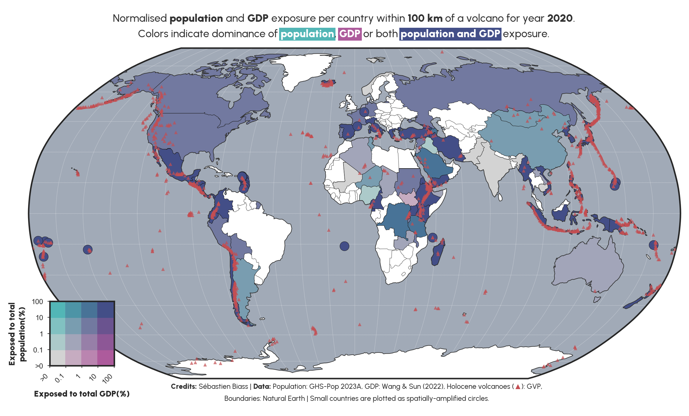

## Supplementary material to chapter 5-3.1 of the Encyclopaedia of Volcanoes (3rd Version)

This repository contains the supplementary material to the **Exposure to volcanic hazards** chapter of the 3rd edition of the Encyclopaedia of Volcanoes by S. Biass , A. Weir, C. Michellier, V. Miller, M. Joffrain, M.L. Bautista, J. Daniell, A. Gunadi Brata B. Mafuko Nyandwi and M. Kervyn. The repository contains two main Python scripts:

- `prepare_hazard_buffer.py`: Creating radial buffers of various radii around the Holocene volcanoes and dissolving them at the country level;
- `process_pop-GDP_GEE.py`: Using Google Earth Engine to perform zonal statistics on gridded population and GDP data.

In addition, the `Output/pop.csv` and `Output/GDP.csv` files contain the result of the analysis. Each file contains these different fields (where *var* can be either `GDP` or `pop`):
- `varA`: Exposure considering *all* volcanoes active during the Holocene according to the [GVP Volcanoes of the World](https://volcano.si.edu) database
- `varS`: Subset of `varA` that considers those volcanoes that had a *significant* eruption as defined by the [NCEI/WDS Global Significant Volcanic Eruptions ](https://www.ncei.noaa.gov/access/metadata/landing-page/bin/iso?id=gov.noaa.ngdc.mgg.hazards:G10147)database
- `varTot`: The total value of the country
- `varAn`, `varSn`: Country exposure normalised to the total country value.

