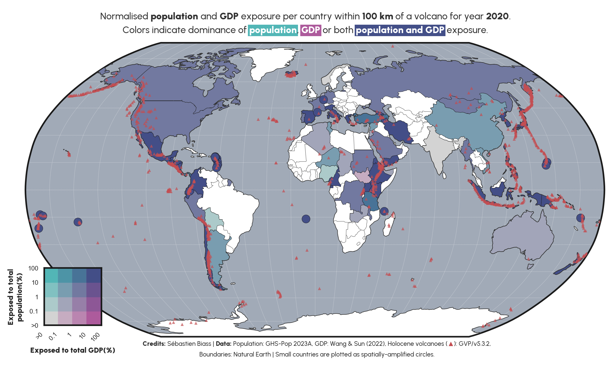

## Supplementary material to chapter 5-3.1 of the Encyclopaedia of Volcanoes (3rd Version)

This repository contains the supplementary material to the **Exposure to volcanic hazards** chapter of the 3rd edition of the Encyclopaedia of Volcanoes.

> S. Biass , A. Weir, C. Michellier, V. Miller, M. Joffrain, M.L. Bautista, J. Daniell, A. Gunadi Brata B. Mafuko Nyandwi and M. Kervyn, **Exposure to volcanic hazards**

> [!NOTE]  
> Results associated with this repository use `v. 5.3.2`. of the Volcanoes of the World database.

The repository contains two main Python scripts:

- `prepare_hazard_buffer.py`: Creating radial buffers of various radii around the Holocene volcanoes and dissolving them at the country level. This requires to install the [`getGVP`](https://github.com/e5k/getGVP) package from `pip`;
- `process_pop-GDP_GEE.py`: Using Google Earth Engine to perform zonal statistics on gridded population and GDP data.

In addition, the `Output/pop.csv` and `Output/GDP.csv` files contain the result of the analysis. Each file contains these different fields (where *var* can be either `GDP` or `pop`):
- `varA`: Exposure considering *all* volcanoes active during the Holocene according to `v. 5.3.2` of the [GVP Volcanoes of the World](https://volcano.si.edu) database;
- `varS`: Subset of `varA` that considers those volcanoes that had a *significant* eruption as defined by the [NCEI/WDS Global Significant Volcanic Eruptions ](https://www.ncei.noaa.gov/access/metadata/landing-page/bin/iso?id=gov.noaa.ngdc.mgg.hazards:G10147)database;
- `varTot`: The total value of the country;
- `varAn`, `varSn`: Country exposure normalised to the total country value.

> [!WARNING]  
> Significant variations in exposure estimates can be introduced associated with the variability of volcanoes identified as active during the Holocene across versions of the Volcanoes of the World database. For instance, `v. 5.2.7` (Feb 2025) contains 1264 volcanoes, whereas `v. 5.3.2` (Sep 2025) contains 1230 volcanoes. 

